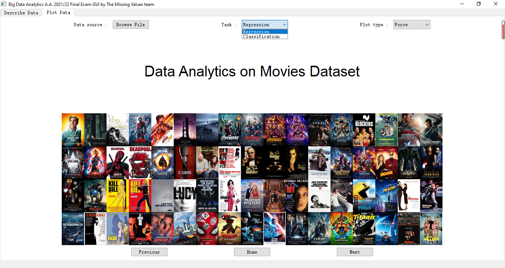
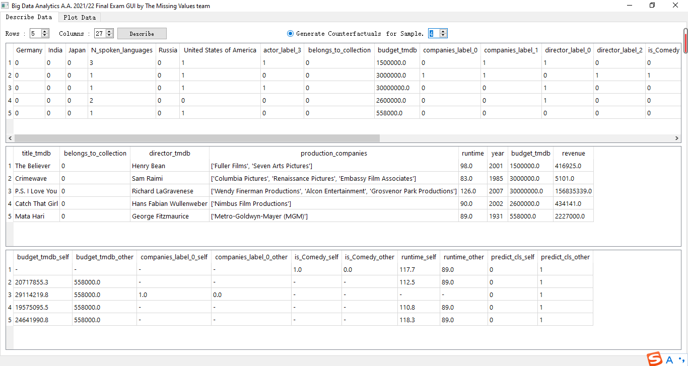
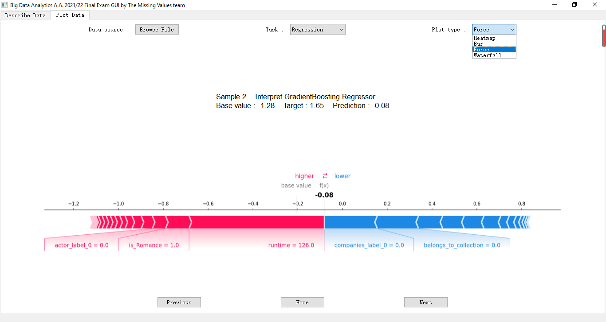

# BDA-Project
Project for Big Data Analytics A.A. 2021/22 by The Missing Values team

## The Movies Dataset
*Link: https://www.kaggle.com/rounakbanik/the-movies-dataset?select=movies_metadata.csv*

These files contain metadata for all 45,000 movies listed in the Full MovieLens Dataset. The dataset consists of movies released on or before July 2017. 
Data points include cast, crew, plot keywords, budget, revenue, posters, release dates, languages, production companies, countries, TMDB vote counts and vote averages.
## Repository structure
```
📦BDA-Project
 ┣ 📂imgs # Images used in GUI
 ┣ 📂inps # Dataset used in GUI
 ┣ 📂models # Models used in GUI
 ┣ 📂resources # Shap resources used to built executable GUI
 ┣ 📂uis # GUI by Qt Designer
 ┃ ┗ 📜plot.ui
 ┣ 📜data_understanding_and_project_proposal.ipynb
 ┣ 📜post_analysis_models_implementation_and_evaluation.ipynb
 ┣ 📜pre_analysis_models_implementation_and_evaluation.ipynb
 ┣ 📜model_interpretation_and_explanation.ipynb
 ┣ 📜notebook_for_the_final_exam.ipynb
 ┣ 📜GUI_plot.py
 ┣ 📜GUI_plot.spec
 ┣ 📜GUI_plot.sh
 ┣ 📜df_test.csv
 ┣ 📜GUI_plot.exe
 ┣ 📜README.md
 ┗ 📜requirements.txt
```

### Files:
Below is the list of files along with its purpose.

- [data_understanding_and_project_proposal.ipynb](data_understanding_and_project_proposal.ipynb):
Data Understanding and Project Proposal

- [post_analysis_models_implementation_and_evaluation.ipynb](post_analysis_models_implementation_and_evaluation.ipynb):
Post-analysis models implementation and evaluation

- [pre_analysis_models_implementation_and_evaluation.ipynb](pre_analysis_models_implementation_and_evaluation.ipynb):
Pre-analysis models implementation and evaluation

- [model_interpretation_and_explanation.ipynb](model_interpretation_and_explanation.ipynb):
Model interpretation and explanation

- [notebook_for_the_final_exam.ipynb](notebook_for_the_final_exam.ipynb):
Notebook for the final exam

- [GUI_plot.py](GUI_plot.py):
GUI in PyQt5 for final exam

- [GUI_plot.spec](GUI_plot.spec):
Spec file to create executable GUI

- [GUI_plot.sh](GUI_plot.sh):
Script to create executable GUI

- [GUI_plot.exe](GUI_plot.exe):
executable GUI for final exam

- [plot.ui](uis/plot.ui):
GUI for final exam by Qt Designer




